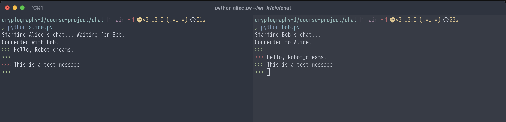

# Курсовий проєкт «Основи криптографії»

Суть курсового проєкту полягає у створенні простого **застосунку для обміну повідомленнями** з
_наскрізним шифруванням_ (end-to-end encryption, aka E2EE).

Це може бути застосунок командного рядка для обміну текстовими повідомленнями.

## Вимоги та припущення

Для простоти, метою є захищення комунікації по мережі двох сторін: **Alice** та **Bob**. Вони комунікують
між собою напряму, без використання сервера.

> Застосунки з наскрізним шифруванням ставлять за мету покладати мінімум довіри на сервер, основна роль
> якого є забезпечення базової функціональності (доставка повідомлень, перетримка зашифрованих повідомлень
> коли адресат знаходиться offline, і т.д.). З точки зору наскрізного шифрування сервер не повинен
> мати доступу до повідомлень так само як і інші посередники.

### Бажані властивості безпеки

* Захист від перехоплення посередником.

  Доступ до незахищеного каналу передачі не повинен розкривати зміст повідомлень між Alice та Bob.

* Захист від атаки посередника (man-in-the-middle).

  Для того щоб активні дії посередника не призвели до компрометації конфіденційності повідомлень,
  необхідно забезпечити взаємну автентифікацію сторін.

* Захист від атаки повторного відтворення (replay attack).

  Повторне відтворення зловмисником перехопленого раніше легітимного повідомлення не повинне сприйматися отримувачем як коректне повідомлення від відправника.
  Для цього протидії таким атакам необхідно слідкувати за порядковим номером повідомлень або міткою часу.

* Пряма секретність.

  Компрометація сесійних ключів шифрування не повинна дозволяти розшифровувати попередні повідомлення.
  Для цього необхідно регулярно узгоджувати нові ключі з використанням протоколу Діффі-Хеллмана.
  При цьому вже використані ключі слід надійно видаляти з памʼяті.

---

Ці базові властивості можна забезпечити, використовуючи:

* Взаємну автентифікацію сторін на довготермінових асиметричних ключах.
* Автентифіковане симетричне шифрування (AES-CBC + MAC, або AES-GCM, або ChaCha20-Poly1305).
* Регулярне оновлення сесійних ключів (тобто ключів шифрування повідомлення) шляхом узгодження Діффі-Хеллмана 
(яке також має бути автентифіковане підписами на довготермінових ключах).

Найвищий рівень захисту для наскрізного шифрування можна забезпечити, реалізувавши спрощений алгоритм
[Double Ratchet](https://signal.org/docs/specifications/doubleratchet/) (без шифрування метаданих та контролю за порядком повідомлень або втрачених повідомлень).

> Коректна реалізація алгоритму Double Ratchet дає можливість **отримати максимальний бал** за курсовий проєкт,
> проте **не є необхідним** для успішного проходження курсу та отримання диплому.

### Формат повідомлень

Немає необхідності в розробці спеціального формату повідомлень: оскільки ми контролюємо обидві сторони,
для простоти можемо надсилати значення необхідні для обміну у фіксованому порядку, і в такому ж порядку
приймати їх на стороні отримувача, та навпаки.

Таким чином, якщо нам неохідно відправити основне зашифроване повідомлення (ciphertext), 
проте разом з ним також необхідно передати інші службові значення:
підпис або імітовставку, `IV` чи `Nonce` для розшифрування повідомлення,
новий публічний ключ обміну Діффі-Хеллмана;
можемо передати їх послідовно у фікосваному порядку:

```python
writer.write(ciphertext)
writer.write(nonce)
writer.write(dh_public)
writer.write(signature)
```

Головне, на стороні отримувача зчитати дані в тому ж порядку:

```python
max_len = 1024
reader.read(payload, max_len)
reader.read(nonce, max_len)
reader.read(dh_public, max_len)
reader.read(signature, max_len)
```

Після чого можемо перевіряти цілісність та автентичність повідомлення, і далі використовувати 
отримані значення.

## Каркас застосунку

Як приклад, у директорії [`course-project/chat`](https://github.com/robot-dreams-code/cryptography-1/tree/main/course-project/chat) до курсового проєкту додається каркас простого застосунку обміну повідомленнями між Alice та Bob _без_ шифрування.
Його можна використати за основу, додаючи криптографічні методи
для захисту повідомлень. Проте за бажання можете написати все з нуля та організувати структуру
застосунку за вашим бажанням.

* Файл `alice.py` містить фукнції для ініціалізації зʼєднання, надсилання, та отримання повідомлень
  з боку Alice. 
* Файл `bob.py` містить фукнції для ініціалізації зʼєднання, надсилання, та отримання повідомлень
  з боку Bob. 
* Файл `utils.py` містить допоміжні фукнції.

Для запуску застосунку, у директорії `course-project/chat` спочатку запустіть `alice.py`:

```bash
python alice.py
```

Потім, в іншому терміналі запустіть `bob.py`.

```bash
python bob.py
```

За замовченням застосунок використовує порт `8888` для комунікації. Якщо цей порт зайнятий на вашій системі,
змініть його на вільний у файлі `utils.py` (змінна `SERVER_PORT = 8888`).

Зелений prompt `>>>` дозволяє ввести повідомлення та надіслати натиском `Enter`.
Червоний prompt `<<<` вказує на отримані повідомлення від іншої сторони.

В разі успішного запуску застосунок виглядатиме наступним чином:


## Формат виконання

Код вашого застосунку та інструкції з його запуску (якщо вони суттєво відрізняються)
завантажте в окрему директорію репозиторію з домашніми завданнями.

В окремому `README.md` файлі коротко опишіть мотивацію обраних вами криптографічних алгоритмів
для забезпечення бажаних властивостей безпеки застосунку.
